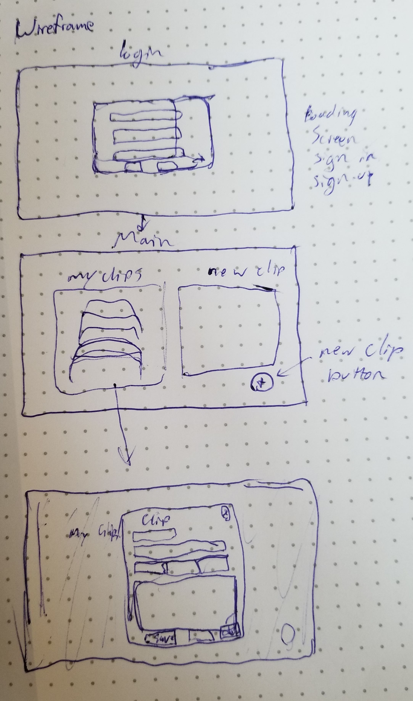
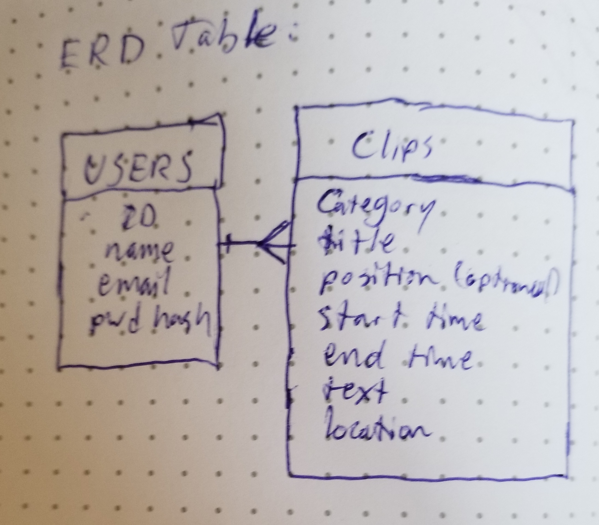

# Resume Clips API

## About
Resume Clips is an app for storing and organizing all of the content you might want to include on a resume. Not everyone took a direct path from high school to the field we are currently working in or would like to work in. As such, we often need different resumes for applying to different positions. What is relevant to one company or industry isn't relevant to another. With Reume Clips, you can keep track of ALL your information to easily reference it when you tweak your resume.

  [The deployed backend of the app](https://resume-clips-rails-api.herokuapp.com/)

  [The repo for the frontend of the app](https://github.com/nicholaspowel/resume-clips-client)

  [The deployed frontend of the app](https://nicholaspowel.github.io/resume-clips-client/)

## Planning
In my planning for the API I first wrote down the types of information I wanted to ba able to store for each clip a user creates. I then converted the information into an Entity Relationship Diagram. I used this as the basis for my scaffolds and migrations in Rails. This allowed me to build and deploy the backend of the app quickly and then move all of my focus to the frontend. I only had one minor bug with the API and permissions for indexing clips, but it only required 5 minutes to fix once found.

## User Stories

As a user:

* I expect to be able to login
* I expect to be able to logout
* I expect to be able to change my password
* I expect to be able to access my clips
* I expect to be able to create new clips
* I expect to be able to modify my resume clips
* I expect to be able to delete clips
* I expect to be able to sign out

## Website Wireframes

## Entity Relationship Diagram

## Routes

-   **User**
        POST /sign-in
        POST /sign-up
        DELETE /sign-out
        PATCH /change-password
-   **Clips**
        GET /clips
        GET /clips/:id
        POST /clips
        DELETE /clips/:id
        PATCH /clips/:id

## Future Features
  - A table for handling collections of clips to be compiled into resumes
  - Additional tables for handling Projects, Education and Work experience separate

## Technologies Used

-   Ruby
-   Ruby on Rails
-   PostgreSQL
-   Rake
-   Heroku CLI
-   Curl scripts for API
